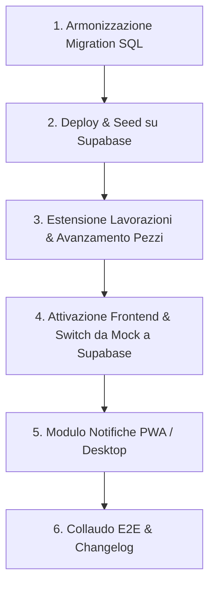

# 📋 Handoff & Piano di Implementazione: Ciclo di Vita Utensili & Lavorazioni CNC

> **Data stesura**: 2026-10-01  
> **Progetto**: Bercella Utensili (Officina 4.0 CNC)  
> **Destinatari**: Sviluppatori, Agenti AI e Sessioni Future  
> **Documenti correlati**: [`docs/CONTRACT_LIFECYCLE.md`](./CONTRACT_LIFECYCLE.md), [`docs/REVIEW_BACKEND_LIFECYCLE.md`](./REVIEW_BACKEND_LIFECYCLE.md)

---

## 🎯 1. Visione Industriale e Decisioni Chiave Approvate

L'implementazione del Ciclo di Vita Utensili è stata rifinita per adattarsi al 100% alla realtà operativa di un'officina meccanica CNC avanzata (lavorazioni compositi, alluminio e titanio per motorsport e aerospace), superando i limiti della gestione teorica da ufficio e azzerando la burocrazia per gli operatori.

### Decisione 1: Da "Commesse" a "Lavorazioni CNC" (Struttura Padre-Figlio)
* **Problema reale**: Un utensile non lavora una "commessa" astratta (es. un intero telaio monoscocca), ma una **specifica lavorazione o fase su una macchina determinata** con un materiale specifico (es. sgrossatura inserti alluminio su CNC 01 vs rifilatura carbonio con frese diamantate su CNC 03).
* **Soluzione adottata**:
  - L'entità operativa a bordo macchina è la **Lavorazione CNC**.
  - Ogni Lavorazione ha:
    - **Commessa Padre** (Codice progetto, es. `24-118 - Telaio Ducati`);
    - **Nome / Fase Lavorazione** (es. `Foratura Guscio Carbonio` o `Inserto Sospensione DX`);
    - **Macchina CNC assegnata** (es. `CNC 03`);
    - **Ubicazione Cassetto/Carrello dedicato** (es. `Cassettiera C · cassetto 4`);
    - **Stato** (`Attiva` / `Chiusa`).
  - Nella UI, tutte le schermate operative parlano di **"Lavorazioni"** per evitare ambiguità.

---

### Decisione 2: Toggle "Tracciamento Ciclo Vita & Pezzi" per Singola Lavorazione
* **Problema reale**: In officina convivono due tipi di produzione:
  1. *Lavorazioni di Serie ripetitive (es. 400 carter Ducati)*: dove monitorare l'usura della fresa è vitale per prevenire rotture e scarti pezzo.
  2. *Attrezzeria / Prototipi / Manutenzione*: dove una fresa per spianare o una punta da centro resta sul mandrino per mesi o anni e fa lavorazioni discontinue. Obbligare a contare i pezzi in questo caso farebbe fallire l'adozione dell'app.
* **Soluzione adottata**:
  - Nella creazione/modifica della Lavorazione è presente lo switch:  
    `traccia_ciclo_vita` (`true` / `false`, default: `false`).
  - **Se DISATTIVO**: Prelievo e deposito standard; zero domande sui pezzi, nessun popup di usura, nessuna notifica di fine turno. La fresa è assegnata alla macchina/cassetto liberamente.
  - **Se ATTIVO**: Si abilitano il target pezzi (es. 400 pz totali della commessa, target vita fresa 50 pz), il semaforo visivo di usura tagliente e i promemoria di fine turno.

---

### Decisione 3: Avanzamento Pezzi Giornaliero a Fine Turno (Metodo 1)
* **Problema reale**: Nessun operatore può ricordarsi a mente dopo 3-4 giorni quanti pezzi ha fatto una fresa montata in macchina (es. 4 pezzi al giorno).
* **Soluzione adottata**:
  - L'operatore o il caporeparto non deve contare le singole frese: **registra solo i pezzi finiti usciti dalla macchina a fine giornata**.
  - Tasto rapido a 1 tap: `[ +4 pezzi oggi ]` (o valore personalizzato).
  - Il sistema incrementa automaticamente il contatore `pezzi_lavorati` di **tutti gli utensili attivi montati su quella lavorazione**.
  - L'accumulo è automatico: Lunedì 4, Martedì 4 ➔ Mercoledì l'app mostra già 8 pezzi accumulati senza calcoli a mente.

---

### Decisione 4: Notifiche e Promemoria Fine Turno (Desktop & Mobile PWA)
* **Problema reale**: A fine turno ci si dimentica di inserire i pezzi del giorno.
* **Soluzione adottata**:
  1. **Notifiche Push / Web Notifications**: All'orario di fine turno (es. 16:45 e 21:45), se la macchina è attiva, compare un banner di sistema su PC desktop e notifica push su smartphone:  
     > *"🏭 Fine turno: Ricordati di registrare i pezzi prodotti oggi su CNC 03!"*  
     Toccando la notifica, l'app si apre direttamente sulla scheda della macchina con i tasti `[ + pezzi ]` pronti.
  2. **Banner In-App (Paracadute Visivo)**: Se le notifiche sono bloccate dal dispositivo, dopo le 15:30 un badge/banner arancione in testa all'app segnala:  
     > *"Promemoria: Pezzi di oggi non ancora inseriti per CNC 03 [Inserisci]"*.

---

### Decisione 5: Chiusura Lavorazione e Persistenza Utensili a Bordo Macchina
* **Problema reale**: Alla chiusura di una lavorazione, le frese non vengono fisicamente rimosse dal magazzino utensili (ATC) o dal mandrino del CNC.
* **Soluzione adottata**:
  - Alla chiusura della Lavorazione, **gli utensili montati NON vengono cancellati né smontati d'ufficio**.
  - Il loro stato rimane `luogo = 'macchina'` (es. CNC 03), mantenendo intatto il contatore di usura reale accumulato.
  - Diventano **"Utensili a bordo macchina (Generico / Disponibili)"**.
  - Quando si apre una nuova Lavorazione su quella macchina, il sistema propone la funzione **"Eredita / Assegna Utensile a Bordo"**: con 1 tap l'utensile viene collegato alla nuova lavorazione senza fare prelievi a magazzino centrale.
  - Per gli utensili sciolti rimasti nel **cassetto dedicato**, l'app mostra un prompt assistito:  
    `"Ci sono 2 frese nel cassetto: vuoi riportarle a magazzino centrale? [Sì, riporta] [Lascia nel cassetto]"`.

---

### Decisione 6: Valutazione Economica (Asset Circolante vs Costo Bruciato)
* **Problema reale**: Attualmente il prelievo scala subito il valore del magazzino considerandolo "costo bruciato", ma la fresa resta in azienda, lavora per settimane e viene riaffilata più volte.
* **Soluzione adottata**:
  - **Parco Utensili Totale Aziendale** =  
    *Valore a Scaffale* (nuovi/riaffilati pronti) +  
    *Valore In Produzione* (montati su CNC o nei cassetti commessa) +  
    *Valore In Riaffilatura* (in viaggio presso terzista).
  - **Il Costo/Consumo si manifesta solo in due casi**:
    1. **Allo Scarto Definitivo (`rotto` o `limite_riaffilature superato`)**: l'utensile esce fisicamente dall'azienda.
    2. **Alla Fattura di Riaffilatura**: costo del servizio esterno (es. 15 € per recuperare un utensile da 120 €, con risparmio netto evidenziato nei KPI del Manager).

---

## 🗄️ 2. Piano Tecnico Database (Supabase / Postgres)

### 2.1 Tabella `commesse` (Estensione per Lavorazioni)
Aggiungere le colonne:
* `nome_lavorazione TEXT NULL` (nome/fase, es. "Foratura Guscio Carbonio");
* `traccia_ciclo_vita BOOLEAN NOT NULL DEFAULT false`;
* `target_pezzi_lotto INTEGER NULL` (target totale della lavorazione, es. 400);
* `pezzi_completati INTEGER NOT NULL DEFAULT 0` (avanzamento cumulativo).

### 2.2 Tabella `posizioni_utensile`
* `id UUID PRIMARY KEY DEFAULT gen_random_uuid()`
* `id_utensile UUID REFERENCES "Utensili_B1"(id) ON DELETE CASCADE`
* `luogo TEXT CHECK (luogo IN ('magazzino','cassetto','macchina','cestello','fornitore'))`
* `stato TEXT CHECK (stato IN ('nuovo','usato','riaffilato'))`
* `n_riaffilature INTEGER NOT NULL DEFAULT 0`
* `id_commessa UUID REFERENCES commesse(id)` (la lavorazione di appartenenza)
* `id_macchina UUID REFERENCES macchine_cnc(id)`
* `id_spedizione UUID REFERENCES spedizioni_riaffilatura(id)`
* `quantita INTEGER NOT NULL CHECK (quantita > 0)`
* `pezzi_lavorati INTEGER NOT NULL DEFAULT 0` (pezzi fatti da questo specifico utensile nel ciclo attuale)
* `target_pezzi_fresa INTEGER NULL` (vita stimata in pezzi prima del cambio, es. 50)
* `entrata_il TIMESTAMPTZ DEFAULT now()`
* `aggiornato_il TIMESTAMPTZ DEFAULT now()`

### 2.3 Tabella `movements_history` (Snapshot Storico)
* `id_operazione UUID` (chiave idempotenza transazionale)
* `id_macchina UUID`
* `luogo_da TEXT`, `luogo_a TEXT`
* `stato TEXT`, `n_riaffilature INTEGER`
* `id_spedizione UUID`
* `causale_scarto TEXT`
* `costo_unitario NUMERIC(10,2)` (fotografia costo al momento dell'evento)
* `pezzi_lavorati INTEGER NULL` (fotografia pezzi completati dall'utensile al momento dello smontaggio/scarto)
* `snapshot_da JSONB`, `snapshot_a JSONB`

### 2.4 Nuove RPC Stored Procedures
1. `registra_avanzamento_lavorazione(p_id_commessa uuid, p_pezzi_aggiunti int, p_id_operatore uuid)`:
   - Incrementa `commesse.pezzi_completati`.
   - Incrementa `posizioni_utensile.pezzi_lavorati` per tutti gli utensili attualmente montati su quella lavorazione e macchina.
2. `eredita_utensile_bordo(p_id_posizione uuid, p_nuova_commessa_id uuid, p_id_operatore uuid)`:
   - Riassegna la posizione montata alla nuova lavorazione senza alterare il mandrino né generare prelievi a magazzino.
3. `chiudi_lavorazione(p_id_commessa uuid, p_svuota_cassetto boolean, p_id_operatore uuid)`:
   - Imposta `stato = 'Chiusa'`.
   - Gli utensili `macchina` passano a `id_commessa = NULL` (Generico a bordo).
   - Se `p_svuota_cassetto = true`, gli utensili in `cassetto` tornano in `magazzino`.

---

## 💻 3. Piano Tecnico Frontend (React + Vite)

1. **Ridenominazione e Viste**:
   - Menu e Sidebar: `Commesse` ➔ `Lavorazioni`.
   - [`src/features/admin/CommesseView.jsx`](file:///Users/gio/Documents/CODING/Berc_utensili/src/features/admin/CommesseView.jsx):
     - Form aggiornato con: Codice Commessa Padre, Nome Lavorazione/Fase, Macchina CNC, Toggle Ciclo Vita, Target Pezzi.
2. **Cruscotto In Produzione ([`InProduzioneView.jsx`](file:///Users/gio/Documents/CODING/Berc_utensili/src/features/produzione/InProduzioneView.jsx))**:
   - Visualizzazione a card per Macchina/Lavorazione:
     - Badge e semaforo vita tagliente:
       - 🟢 0-70% vita
       - 🟡 70-90% vita
       - 🔴 >90% vita (Consigliato cambio)
     - Tasto rapido `[ + pezzi oggi ]` con dialog o stepper veloce.
3. **Prelievo Guidato ([`PrelievoGuidato.jsx`](file:///Users/gio/Documents/CODING/Berc_utensili/src/features/produzione/PrelievoGuidato.jsx))**:
   - Selezione chiara: `[24-118] Foratura Guscio Carbonio · CNC 03`.
   - Se su CNC 03 è già presente la stessa fresa: chip a 1 tap:  
     *"Sostituisci quella consumata su CNC 03? [Sì, consumata]"*.
4. **Modulo Notifiche ([`src/lib/notifications.js` e `usePwaStore.js`])**:
   - Richiesta permesso Web Notifications.
   - Timer/Worker per notifica di fine turno (16:45 / 21:45).
   - Banner visivo in testata per avviso in-app post 15:30.
5. **Switch Supabase e Pulizia**:
   - Impostare `VITE_LIFECYCLE_SOURCE=supabase` e `VITE_LIFECYCLE_UI=true`.
   - Rimuovere il fallback client-side in `useMovementStore` e `useMultiMovementStore` (evita conflitti con il trigger di `posizioni_utensile`).

---

## 🚀 4. Sequenza Operativa per la Nuova Sessione

### Checklist Dettagliata per la Nuova Sessione:

- [ ] **Step 1: Armonizzare i file SQL esistenti**
  - Integrare le colonne `nome_lavorazione`, `traccia_ciclo_vita`, `target_pezzi_lotto`, `pezzi_completati` nella migrazione `commesse`.
  - Integrare `pezzi_lavorati` e `target_pezzi_fresa` in `posizioni_utensile` e `movements_history`.
  - Aggiungere le RPC `registra_avanzamento_lavorazione`, `eredita_utensile_bordo`, `chiudi_lavorazione`.
- [ ] **Step 2: Eseguire la migrazione sul database Supabase**
  - Eseguire i file `lifecycle_1`, `lifecycle_2`, `lifecycle_3`, `lifecycle_4` e le estensioni lavorazioni.
  - Popolare `posizioni_utensile` iniziale per i 1.345 articoli (tutti a magazzino, nuovo, quantità fedele).
  - Verificare che il trigger di allineamento su `Utensili_B1."Quantità"` sia attivo e reattivo.
- [ ] **Step 3: Aggiornare UI Gestione Lavorazioni (`CommesseView.jsx`)**
  - Ridenominare in "Lavorazioni".
  - Aggiungere il toggle del ciclo vita e il target pezzi.
- [ ] **Step 4: Aggiornare Cruscotto "In Produzione" (`InProduzioneView.jsx`)**
  - Inserire il pulsante rapido di avanzamento pezzi fine turno `[ + pezzi ]`.
  - Inserire la barra di usura a semaforo per le lavorazioni con ciclo vita attivo.
  - Gestire la chip "Eredita utensile a bordo".
- [ ] **Step 5: Attivare Notifiche di Fine Turno**
  - Chiedere permesso notifiche in PWA.
  - Attivare promemoria locale/push a fine turno e banner in-app.
- [ ] **Step 6: Switch Ambientale & Test E2E**
  - Configurare `.env` con `VITE_LIFECYCLE_SOURCE=supabase` e `VITE_LIFECYCLE_UI=true`.
  - Rimuovere il vecchio fallback client-side in `useMovementStore`/`useMultiMovementStore`.
  - Testare l'intero ciclo: Prelievo ➔ Avanzamento pezzi ➔ Sostituzione con invio al cestello ➔ Spedizione DDT ➔ Rientro ➔ Chiusura lavorazione con utensili ereditati.
  - Registrare tutto in `CHANGELOG.md`.
